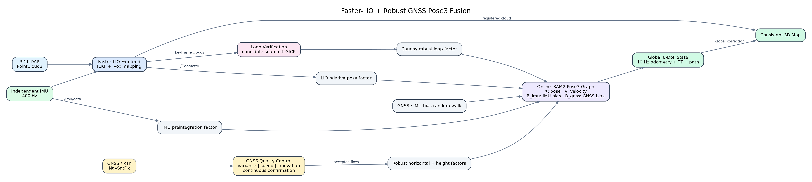
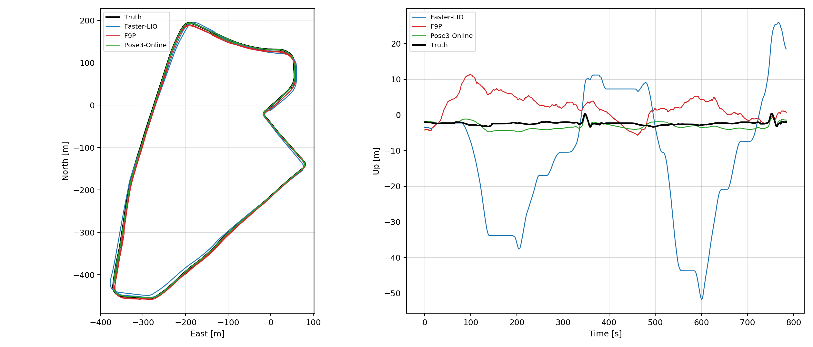
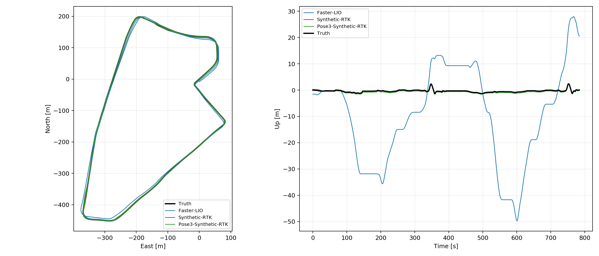

<div align="center">

# Faster-LIO GNSS Fusion

### Robust online LiDAR-Inertial-GNSS localization for urban canyons

Faster-LIO front-end · GTSAM iSAM2 back-end · robust GNSS factors · GICP loop closure

[English](README.md) | [简体中文](README_zh-CN.md)

</div>

---

This repository implements a complete ROS 1 localization and mapping pipeline
that extends Faster-LIO with a causal online Pose3 factor graph. The system is
designed for urban environments where GNSS may be noisy, biased, intermittent,
or temporarily unavailable.

The project was validated on `UrbanNav-HK-Medium-Urban-1`. Ground truth is used
only for visualization and evaluation; it is never inserted into the online
factor graph.

<p align="center">
  
</p>

## Highlights

- High-rate LiDAR-inertial odometry and 3D point-cloud mapping.
- Causal online iSAM2 optimization with pose, velocity, IMU bias, and GNSS bias
  states.
- Horizontal GNSS, height, IMU preintegration, LIO relative-pose, and robust
  GICP loop factors.
- GNSS variance, speed, innovation, and consecutive-fix gating.
- A 60-second initialization window for fixed local-to-ENU alignment.
- Reproducible UrbanNav benchmark and centimeter-RTK upper-bound experiment.
- RViz visualization and automatic ATE/RPE report generation after bag replay.

## Factor Graph

For keyframe `k`, the optimized state is:

<p align="center">
  
</p>

| Factor | Purpose |
|---|---|
| LIO relative pose | Preserves high-frequency local geometry and motion |
| IMU preintegration | Constrains 3D motion, velocity, gravity, and IMU bias |
| Horizontal GNSS | Corrects long-term global XY drift |
| GNSS height | Constrains vertical drift with an independent robust model |
| GNSS bias random walk | Models slowly varying urban-canyon bias |
| GICP loop closure | Reduces accumulated drift when geometry is revisited |
| Velocity consistency | Stabilizes vertical velocity against the LIO front-end |

GNSS observations are accepted only after passing independent quality checks.
Huber kernels are used for GNSS measurements and a Cauchy kernel is used for
loop closures.

## UrbanNav Results

Evaluation uses one fixed SE(2) alignment and one vertical offset estimated from
the first 60 seconds. No later truth-based alignment is performed.

| System | Horizontal RMSE | Vertical RMSE | 3D RMSE | 100 m RPE |
|---|---:|---:|---:|---:|
| Faster-LIO | 6.108 m | 20.395 m | 21.290 m | 2.421 m |
| F9P NMEA | 5.119 m | 5.869 m | 7.788 m | 2.154 m |
| **Pose3 fusion** | **0.550 m** | **1.252 m** | **1.368 m** | **0.292 m** |

<p align="center">
  
</p>

The real F9P measurements are meter-level in this urban canyon. The fused
trajectory improves horizontal RMSE by approximately 89.2% relative to raw F9P
and provides continuous 6-DoF localization between GNSS updates.

### Centimeter-RTK Upper Bound

A second experiment adds deterministic Gaussian noise to the reference
trajectory: 2 cm standard deviation in East/North and 4 cm in height.

| System | Horizontal RMSE | Vertical RMSE | 3D RMSE | 100 m RPE |
|---|---:|---:|---:|---:|
| Synthetic RTK | 0.031 m | 0.040 m | 0.050 m | 0.043 m |
| **Pose3 + synthetic RTK** | **0.066 m** | **0.339 m** | **0.345 m** | **0.043 m** |

<p align="center">
  
</p>

This experiment is an architecture upper-bound study, not an independent
accuracy claim. It shows centimeter-level horizontal capability with ideal
GNSS, while the remaining vertical error exposes inconsistency among LIO
height, IMU preintegration, and the GNSS height model.

Machine-readable summaries are stored in
[`docs/benchmarks`](docs/benchmarks).

## Repository Layout

```text
.
├── data/                         # local datasets, excluded from Git
├── docs/
│   ├── assets/                   # architecture and benchmark figures
│   └── benchmarks/               # compact result summaries
└── src/
    ├── faster-lio/               # LiDAR-inertial front-end
    └── faster_lio_gnss/          # online Pose3 fusion and evaluation
```

The fusion package intentionally has only three launch entry points:

| Launch file | Use |
|---|---|
| `pose3_fusion_live.launch` | Real sensors and an externally started Faster-LIO |
| `urbannav_final_test.launch` | Real F9P UrbanNav benchmark |
| `urbannav_synthetic_rtk_test.launch` | Centimeter-RTK upper-bound benchmark |

## Requirements

- Ubuntu 20.04
- ROS Noetic
- C++17 compiler
- Eigen3, PCL, yaml-cpp, glog
- GTSAM 4.x
- Python 3 with NumPy and Matplotlib

## Build

```bash
cd /path/to/fasterlio_multi
catkin_make -DCMAKE_BUILD_TYPE=Release
source devel/setup.bash
```

## Run With Real Sensors

Start the LiDAR, IMU, GNSS drivers and Faster-LIO first, then run:

```bash
roslaunch faster_lio_gnss pose3_fusion_live.launch
```

Default inputs:

```text
/Odometry          nav_msgs/Odometry
/velodyne_points   sensor_msgs/PointCloud2
/imu/data          sensor_msgs/Imu
/gnss/fix          sensor_msgs/NavSatFix
```

Primary outputs:

```text
/odometry/pose3_online
/pose3_online/path/lio
/pose3_online/path/gnss
/pose3_online/path/fused
/pose3_online/loop_edges
TF: gnss_enu_pose3 -> odom
```

Sensor topics and extrinsics can be overridden directly:

```bash
roslaunch faster_lio_gnss pose3_fusion_live.launch \
  lio_topic:=/lio/odometry \
  cloud_topic:=/lidar/points \
  imu_topic:=/imu/data \
  gnss_topic:=/rtk/fix \
  antenna_x:=0.0 antenna_y:=-0.86 antenna_z:=0.31
```

## Reproduce UrbanNav

Download the dataset as described in [`data/README.md`](data/README.md), then:

```bash
roslaunch faster_lio_gnss urbannav_final_test.launch \
  bag_file:=/path/to/test.bag \
  nmea_file:=/path/to/f9p.splitter.nmea \
  ground_truth_file:=/path/to/UrbanNav_TST_GT_raw.txt
```

The dataset launch uses a dedicated evaluation RViz view. After the first
60 seconds, it applies the same fixed truth-based SE(2) and vertical alignment
as the reported metrics. These aligned topics are visualization aids only;
`pose3_fusion_live.launch` continues to show the unmodified online output.

For the ideal-RTK experiment:

```bash
roslaunch faster_lio_gnss urbannav_synthetic_rtk_test.launch \
  bag_file:=/path/to/test.bag \
  ground_truth_file:=/path/to/UrbanNav_TST_GT_raw.txt
```

Evaluation outputs are written below
`~/.ros/faster_lio_gnss/` by default.

## Practical Interpretation

Sensor fusion is not expected to outperform a continuously available,
noise-free RTK position at every timestamp. Its engineering value is:

- high-rate 6-DoF state estimation;
- continuity during RTK outages or degradation;
- rejection of urban multipath outliers;
- attitude, velocity, and mapping-frame consistency;
- smooth global recovery after GNSS returns.

The current system reaches approximately 0.55 m horizontal RMSE with the noisy
UrbanNav F9P data and 0.066 m in the synthetic centimeter-RTK experiment.

## Citation

This project uses Faster-LIO as its LiDAR-inertial front-end:

```bibtex
@article{bai2022fasterlio,
  title   = {Faster-LIO: Lightweight Tightly Coupled Lidar-Inertial
             Odometry Using Parallel Sparse Incremental Voxels},
  author  = {Bai, Chunge and Xiao, Tao and Chen, Yajie and Wang, Haoqian
             and Zhang, Fang and Gao, Xiang},
  journal = {IEEE Robotics and Automation Letters},
  volume  = {7},
  number  = {2},
  pages   = {4861--4868},
  year    = {2022},
  doi     = {10.1109/LRA.2022.3152830}
}
```

See [`src/faster-lio/LICENSE`](src/faster-lio/LICENSE) for the upstream license.
